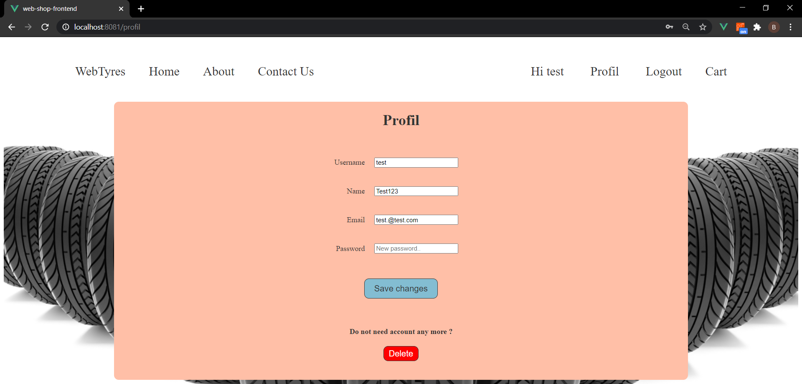

# WebShopForTyresFrontend

### This is frontend part of the web application with possibility to search for, filter, write and save blogs persistently. It is written in Vue js framework, and application is linked with [backend](https://github.com/brankovitorovic/WebShopForTyres) with RESTful API. Application is SPA.

  
How to use

  
#### Download the code and import in desired IDE,then in file src/store/auth.js set axios.defaults.baseURL  for your base URL and run it with npm run serve ( -- --port XXXX if port needs to be change, default is 8080).

  
Technologies and libraries

   
  
 1. HTML5
 2. Css
 3. Vue js ( router, vuex )
 4. Javascript
 5. Axios

  
Screenshot of web page

   
  
  #### Index page
  
  
  #### Profil page
  
  
  
  #### Add post page
  
 
  

