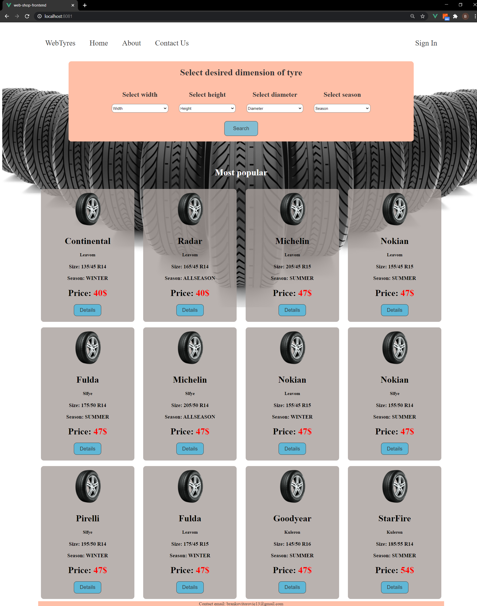
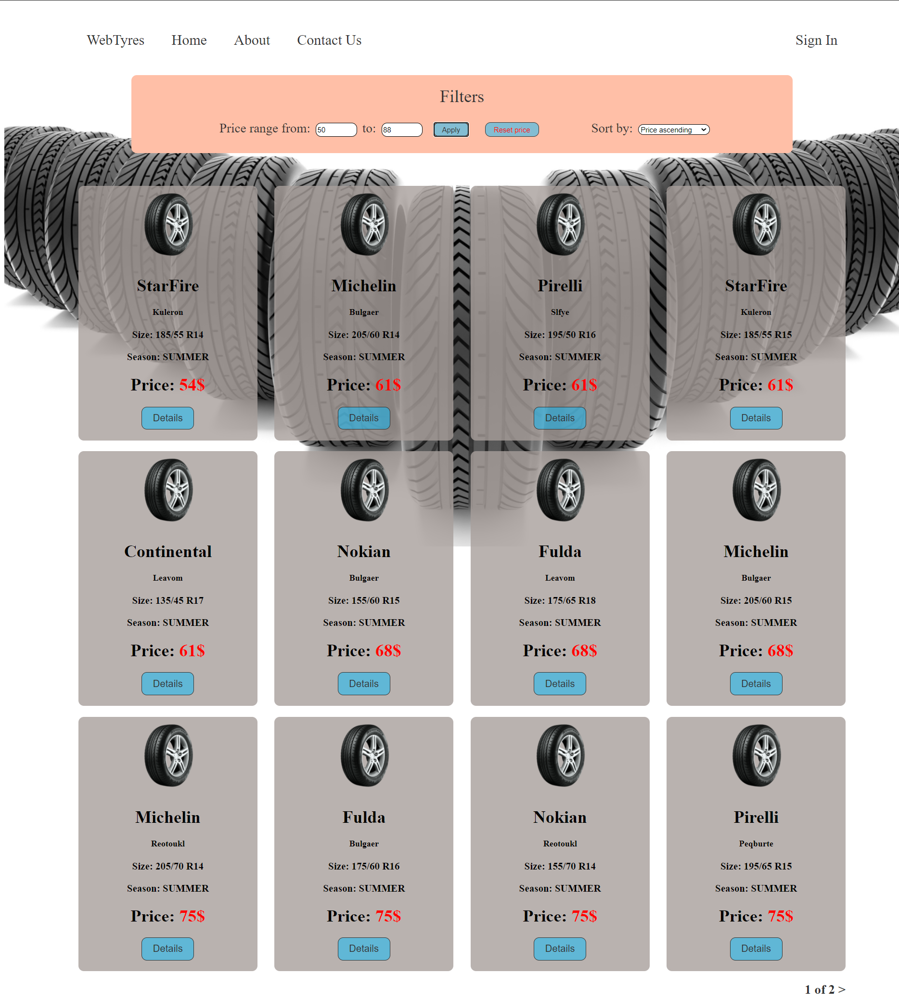
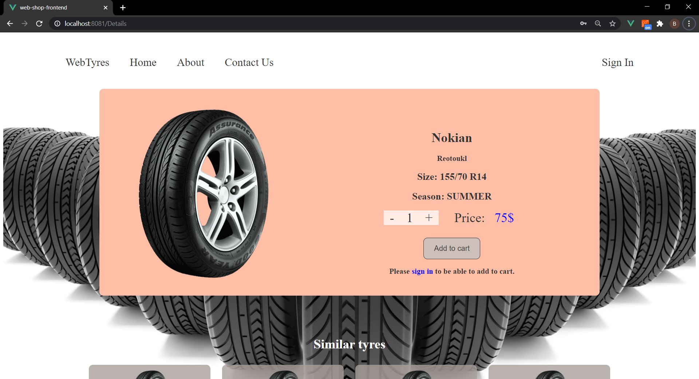
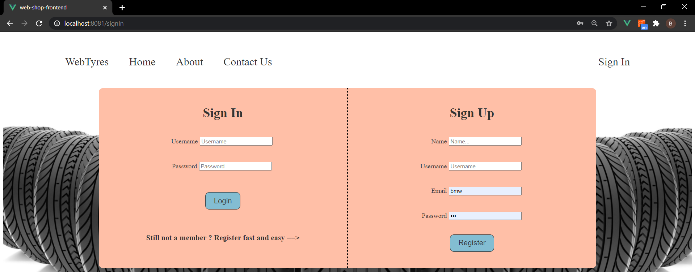
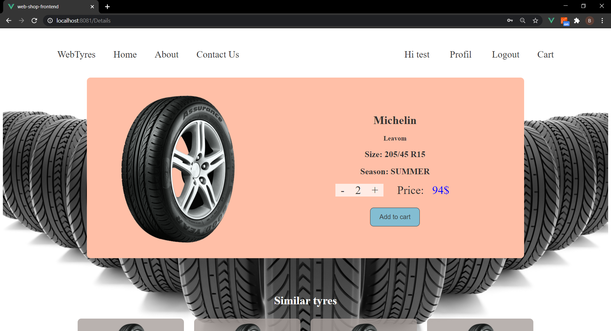
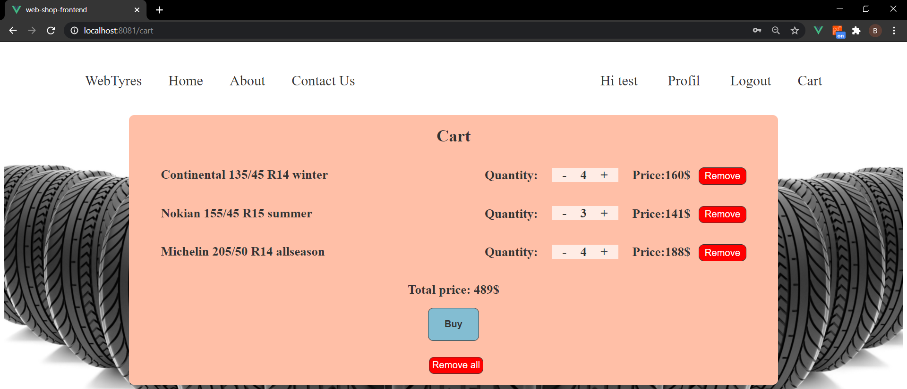
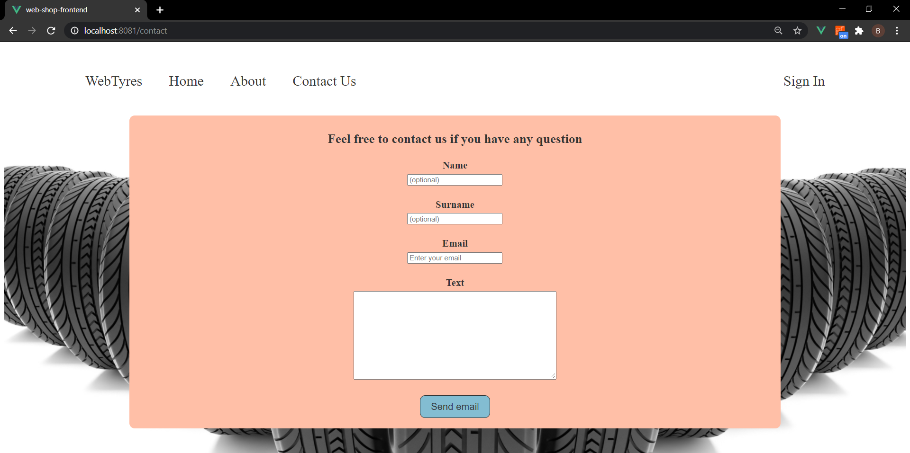

# WebShopForTyresFrontend

### This is frontend part of the e-commerce web shop for tyres with possibility to sign in, search, filter and save desired tyres persistently in own cart. It is written in Vue js framework, and application is linked with [backend](https://github.com/brankovitorovic/WebShopForTyres) with RESTful API. Application is SPA.

  
How to use

#### Download the code and import in desired IDE,then in file web-shop-for-tyres-frontend/src/store/auth.js set axios.defaults.baseURL  for your base URL and run it with npm run serve ( -- --port XXXX if port needs to be change, default is 8080).

  
Technologies and libraries

   

 1. HTML5
 2. Css
 3. Vue js ( router, vuex )
 4. Javascript
 5. Axios

  
Screenshot of web page

   

  #### Index page
  

  #### After search

  

  #### Details about tyre

  

  #### Sign In/Up

 

  #### Details when signed in

  

  #### Cart page
  

  #### Profil page

  

  #### Contact us page

  

